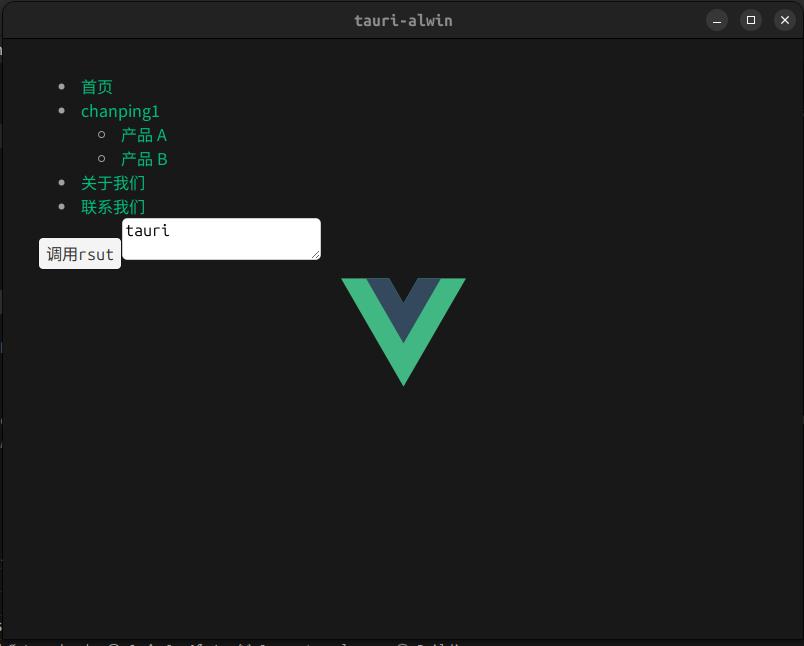

# 项目介绍:[https://boke.maoxiaomiyy.com/?p=1491](https://boke.maoxiaomiyy.com/?p=1491)

效果:


## 部署并使用tauri
linux 下部署

1. linux相关依赖
```
sudo apt update
sudo apt install libwebkit2gtk-4.0-dev \
    build-essential \
    curl \
    wget \
    libssl-dev \
    libgtk-3-dev \
    libayatana-appindicator3-dev \
    librsvg2-dev
```
2. rust `curl --proto '=https' --tlsv1.2 https://sh.rustup.rs -sSf | sh`

3. 使用rsut的包管理工具安装tauri
```
cargo install create-tauri-app --locked
cargo create-tauri-app
cargo install tauri-cli
```

4. 你会获得一个目录
/src   :  这个是前端目录,你用任何前端框架都可以,然后build后放到这个目录即可,比如我用vue 然后build 完了有index.html assets文件夹,直接复制进去就行
/src-tauri : 这个是rust目录,及启动窗口的目录: 进到这个目录`cargo tauri dev` 启动应用程序

# Tauri + Vanilla

This template should help get you started developing with Tauri in vanilla HTML, CSS and Javascript.

## Recommended IDE Setup

- [VS Code](https://code.visualstudio.com/) + [Tauri](https://marketplace.visualstudio.com/items?itemName=tauri-apps.tauri-vscode) + [rust-analyzer](https://marketplace.visualstudio.com/items?itemName=rust-lang.rust-analyzer)
